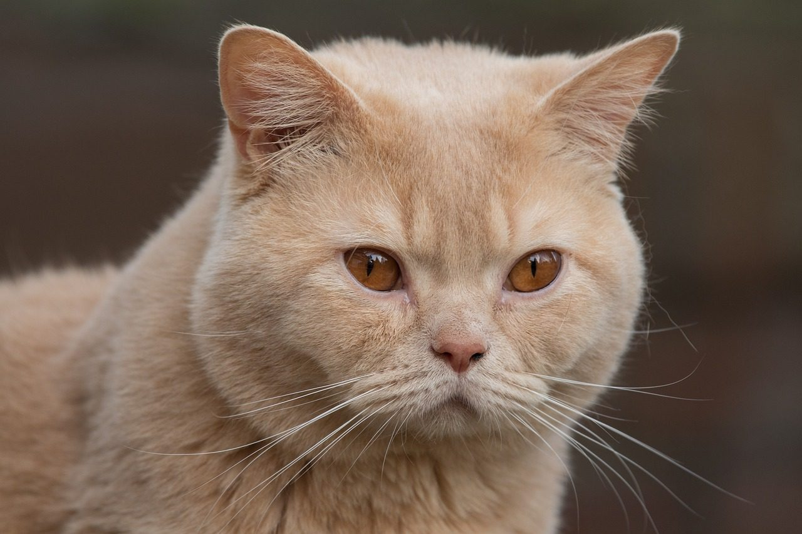

# Vicky Raymond-Janvier

Photo d'un fameux chat

## **Intérêts dans le multimedia**
Dans le multimédias, j'aime beaucoup tout ce qui touche la création, que se sois des illustration, logo ou meme des sites webs. J'ai beaucoup été inspirer de peintres et différente techniques de peinture, ce qui me permet d'avoir un second regars sur l'art digital. J'aime aussi beaucoup la photographie / vidéo, l'agencemet de couleurs et les possibilité infini.

À consulter ici:
<https://www.youtube.com/watch?v=ovc3ty_vqG0>

**ou**
en cliquant sur l'image:

## Ce qui me plait dans l'introduction à la muséologie en TIM
Partager avec les étudiant.e.s des expériences permettant de poser un regard large sur l'expérience vécue par les spectacteurs qui perçoivent l'oeuvre ou le dispositif dans un contexte d'exposition.  
Apprendre à s'intéresser à toutes les composantes physiques et techniques qui interviennent dans la réception de la création.

>💡 **Astuce** N'hésitez pas à vous référer aux conseils sur le codage Markdown <https://www.markdownguide.org/basic-syntax/>

**EXEMPLE AJOUT DE PHOTO**
Vous devez vous assurer qu'il y a une ligne de libre avant et après votre ligne de commande.

Oeuvre de Miguel Leache, *Rapido Rem*, 2022, présentée lors des **Rencontres Photo Gaspésie 2023**
