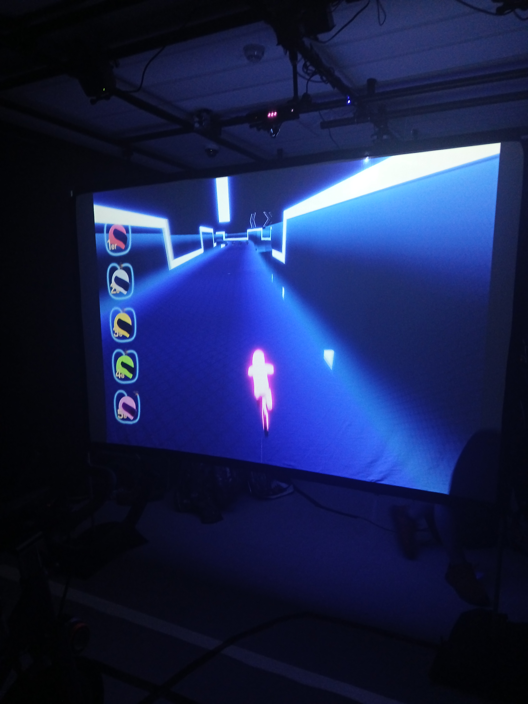

# *C0N-DU8*

C0n-du0, est l'un des projet multimédia inclu dans l'exposition resonance réaliser par des finissants de l'hiver 2025 de la Technique d'Intégration Multimédia au collège Montmorency. Ils ont été réalisés dans le cadre du cour 'Expérience multimédia' donné lors de leur dernière session. Ce cours a été encadré par `Guillaume Arseneault` et `Thomas Ouellet Fredericks`. La réalisation de ce projet a également été rendue possible grâce à l’appui de `William Racine` et `Antoine Allard`, techniciens de travaux pratiques en Technique d'Intégration Multimédias. 

L’exposition s’est tenue au <ins>`Collège Montmorency`</ins> dans la salle C-1712 et C-1710 durant la semaine du `16 mars 2025`! 

Cette exposition est donc `temporaire.` Le type d'installation est `contemplative, immersive et interactive!`   

Ma visite du lieu a eu lieu le 18 mars 2025. 

***
 
## Pourquoi es-ce mon preféré?
Je trouve que C0N-DU8 est originale tout autant dans son design neon, la facon d'ont les visiteurs doivent intéragir avec le dispositif et son histoire!

### Son design

### Son intéractivité

### Son histoire

## Premières impressions
Dès mon arrivée, c’est la `grandeur et les couleurs` utilisées qui ont immédiatement capté mon attention. La `musique d’ambiance`, rappelant une forêt enchantée, m’a plongée dans une `atmosphère immersive` avant même d’entrer dans l’installation.

Avant ma visite aux studios TIM, je me demandais comment les étudiants en multimédia parviendraient à `créer des expériences interactives et immersives` liées à leur thématique, tout en utilisant les `compétences` qu'ils ont acquises au cours de leur `formation en technique d'intégration multimédia`!

## Appréciation générale

J’ai trouvé que la `présentation` et `l’ambiance` étaient les points forts de l’expérience. Les deux salles regroupant les installations étaient plongées dans une `obscurité tamisée`, avec une lumière basse et une `mise en scène végétale` qui renforçait l’effet immersif. Cet univers donnait aux installations une `atmosphère magique` et `mystérieuse` qui les mettait en valeur.

***

## C0N-DU8

<i>L'exposition Internature | Photo prise par Vicky Raymond-Janvier</i>

Ce dispositif a été crée par : `Ian Corbin`, `Samuel_Desmeules_Voyer` et `Alexandre_Gervais`, `Kevin_Malric

## Intention

## Visuel
  

<i>La planation d'Internature | **[Voici la source de l'image!](https://tprangers.github.io/internature/#/30_production/60_plantation/)**<i>

## Interactions

### Theme sonore
Le thème sonore est basé sur de la musique intense et de la musique Synthwave.

### Theme visuel
Le thème visuel est basé sur un thème plutôt néon et futuriste.

## Composantes majeures
PC 
Voltmètre 
Kinect 
Projecteur 
Carte de son 
Haut-Parleur x 2 
USB-C 
USB x 2 
HDMI 
Etherne 
Câble XLR x 2 

## Applications utilisé
Unity 
Visual Studio Community 2022 
Maya 
Blender 
Touch Designer 
Arduino 
Reaper 

## Montant
Le montant total pouvant être mis dans ce projet était de 500$, le coût a été de seulement 284,25$.

## Conclusion
C0N-DU8 était une expérience originale, 

## Cours primordiaux
En voyant ce que cette équipe a réalisé, ce projet n'aurait pas été possible sans : 
Le cour de d'`animation 3d` 
Le cour d'`objets interactifs` 
Le cour de d'`interactivité ludique` 

Pour avoir plus d'informations sur les cours : **[Grille de cours de la Technique d'Intégration Multimédia](https://www.cmontmorency.qc.ca/programmes/nos-programmes-detudes/techniques/techniques-dintegration-multimedia/grille-de-cours/)**

## Améliorations
Le jeu est trop exigeant, ce qui rend difficile son achèvement. De plus, la course manque de dynamisme et devient rapidement monotone, manquant de stimuli pour maintenir l'intérêt du joueur.

## Autre informations
Vidéo Promotionnelle : **[Youtube](https://www.youtube.com/watch?v=uQutqaW_Ego)**  
Plus d'information : **[Github d'Internature](https://gearshift-games.github.io/Web-C0N-DU8/#/)**   
Sources
> **[Github d'Internature](https://gearshift-games.github.io/Web-C0N-DU8/#/)**

***

