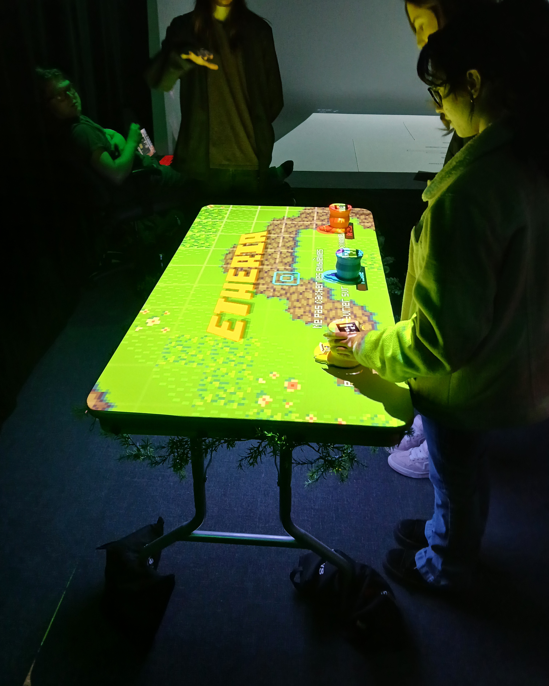

# *Resonance*
Resonance est un <ins>`projets multimedias`</ins> réalisé par les finissants de l'hiver 2025 de la Technique d'Intégration Multimédia au collège Montmorency. Ces ont été réalisés dans le cadre du cour 'Expérience multimédia' donné lors de leur dernière session. Ce cours a été encadré par `Guillaume Arseneault` et `Thomas Ouellet Fredericks`. La réalisation de ce projet a également été rendue possible grâce à l’appui de `William Racine` et `Antoine Allard`, techniciens de travaux pratiques en Technique d'Intégration Multimédias. 

L’exposition s’est tenue au <ins>`Collège Montmorency`</ins> dans la salle C-1712 et C-1710 durant la semaine du `16 mars 2025`! 

Cette exposition est donc `temporaire.` Le type d'installation est `contemplative, immersive et interactive!`   

Ma visite du lieu a eu lieu le 18 mars 2025. 

***
 
## Pourquoi ai-je créé cette fiche?
Je suis ravie d’avoir eu l’occasion d’assister à l’exposition des finissants 2025. J’ai donc décidé de `partager mes observations` sur les différents projets que j’ai explorés dans les studios TIM de Montmorency, classés ici par `ordre de préférence`!

## Au départ
Avant ma visite aux studios TIM, je me demandais comment les étudiants en multimédia parviendraient à `créer des expériences interactives et immersives` liées à leur thématique, tout en utilisant les `compétences` qu'ils ont acquises au cours de leur `formation en technique d'intégration multimédia`!

## Appréciation générale
J’ai trouvé que la `présentation` et `l’ambiance` étaient les points forts de l’expérience. Les deux salles regroupant les installations étaient plongées dans une `obscurité tamisée`, avec une lumière basse et une `mise en scène végétale` qui renforçait l’effet immersif. Cet univers donnait aux installations une `atmosphère magique` et `mystérieuse` qui les mettait en valeur.

L’exposition comptait `sept installations en tout`, dont six documentées ici. Si vous souhaitez découvrir la septième, qui est mon coup de cœur, rendez-vous sur ma fiche dédiée ici : **[C0N-0U8]()**

***

## Internature (2ème place)

<i>L'exposition Internature | Photo prise par Vicky Raymond-Janvier</i>

Ce dispositif a été crée par : `Khaly Tia Sing`, `Isaac Fafard`, `Delphine Grenier`, `Sitemonternna Yi` et `Kenza El Harrif`

## Intention
Internature est un `tunnel interactif` permettant aux visiteurs de `contrôler la croissance de la nature` autour d’eux.

## Visuel
L’installation prend la forme d’une `serre` entourée de `projections animées de faune et de flore` et de `fausses plantes`. Au centre, une `sphère lumineuse` est posée sur un pilier en bois, servant d’élément interactif principal.

<i>La planation d'Internature | **[Voici la source de l'image!](https://tprangers.github.io/internature/#/30_production/60_plantation/)**<i>

## Interactions
La `sphère centrale` pouvait être tournée, permettant ainsi de faire `pousser la nature` autour de nous.

## Attentes
Dès mon arrivée, c’est la `grandeur et les couleurs` utilisées qui ont immédiatement capté mon attention. La `musique d’ambiance`, rappelant une forêt enchantée, m’a plongée dans une `atmosphère immersive` avant même d’entrer dans l’installation.

Située au centre du plus grand des studios d’exposition, Internature a été la première œuvre à `attirer mon regard`. Son `ampleur` et son `esthétisme` m’ont donné l’envie de la découvrir.

## Conclusion
Ce qui m'a particulièrement frappée, c'est l'interaction offerte par la `sphère lumineuse` au centre de l'installation. En la faisant tourner, j'ai vu la `nature autour de moi s'animer à chaque mouvement`, comme si je participais activement à la `création d'un monde végétal`. Cette interaction m'a permise de ressentir une certaine forme de `pouvoir`, mais aussi une `connexion` avec la nature.

## Cours primordiaux
En voyant ce que cette équipe a réalisé, ce projet n'aurait pas été possible sans : 
Le cour de `réalité mixte` 
Le cour d'`installation multimédia` 
Le cour de `conception d’une expérience multimédia` 

Pour avoir plus d'informations sur les cours : **[Grille de cours de la Technique d'Intégration Multimédia](https://www.cmontmorency.qc.ca/programmes/nos-programmes-detudes/techniques/techniques-dintegration-multimedia/grille-de-cours/)**

## Améliorations
Si c'était à moi de concevoir l'installation, je choisirais de `fermer complètement les deux entrées de la serre` afin de créer une `immersion totale`, sans distraction extérieure. Dans cette optique, je proposerais d’`ajouter une texture naturelle` en corélation avec les projections, afin de créer un environnement `cohérent` et `organique`.

## Autre informations
Vidéo Promotionnelle : **[Youtube](https://www.cmontmorency.qc.ca/programmes/nos-programmes-detudes/techniques/techniques-dintegration-multimedia/grille-de-cours/](https://www.youtube.com/watch?v=vxIGUEq9AZg&t=1s)** 
Plus d'information : **[Github Etheria](https://www.cmontmorency.qc.ca/programmes/nos-programmes-detudes/techniques/techniques-dintegration-multimedia/grille-de-cours/)
Sources
> **[Github d'Internature](https://tprangers.github.io/internature/#)**

***

## Etheria (3ème place)

<i>L'exposition Internature | Photo prise par Vicky Raymond-Janvier</i>

Ce dispositif a été crée par : `Khaly Tia Sing`, `Isaac Fafard`, `Delphine Grenier`, `Sitemonternna Yi` et `Kenza El Harrif`

## Intention
Internature est un `tunnel interactif` permettant aux visiteurs de `contrôler la croissance de la nature` autour d’eux.

## Visuel
L’installation prend la forme d’une `serre` entourée de `projections animées de faune et de flore` et de `fausses plantes`. Au centre, une `sphère lumineuse` est posée sur un pilier en bois, servant d’élément interactif principal.

<i>La planation d'Internature | **[Voici la source de l'image!](https://ethereal-creators.github.io/Etheria/#/30_production/60_plantation/)**<i>

## Interactions
La `sphère centrale` pouvait être tournée, permettant ainsi de faire `pousser la nature` autour de nous.

## Attentes
Dès mon arrivée, c’est la `grandeur et les couleurs` utilisées qui ont immédiatement capté mon attention. La `musique d’ambiance`, rappelant une forêt enchantée, m’a plongée dans une `atmosphère immersive` avant même d’entrer dans l’installation.

Située au centre du plus grand des studios d’exposition, Internature a été la première œuvre à `attirer mon regard`. Son `ampleur` et son `esthétisme` m’ont donné l’envie de la découvrir.

## Conclusion
Ce qui m'a particulièrement frappée, c'est l'interaction offerte par la `sphère lumineuse` au centre de l'installation. En la faisant tourner, j'ai vu la `nature autour de moi s'animer à chaque mouvement`, comme si je participais activement à la `création d'un monde végétal`. Cette interaction m'a permise de ressentir une certaine forme de `pouvoir`, mais aussi une `connexion` avec la nature.

## Cours primordiaux
En voyant ce que cette équipe a réalisé, ce projet n'aurait pas été possible sans : 
Le cour de `réalité mixte` 
Le cour d'`installation multimédia` 
Le cour de `conception d’une expérience multimédia` 

Pour avoir plus d'informations sur les cours : **[Grille de cours de la Technique d'Intégration Multimédia](https://www.cmontmorency.qc.ca/programmes/nos-programmes-detudes/techniques/techniques-dintegration-multimedia/grille-de-cours/)**

## Améliorations
Si c'était à moi de concevoir l'installation, je choisirais de `fermer complètement les deux entrées de la serre` afin de créer une `immersion totale`, sans distraction extérieure. Dans cette optique, je proposerais d’`ajouter une texture naturelle` en corélation avec les projections, afin de créer un environnement `cohérent` et `organique`.

## Autre informations
Vidéo Promotionnelle : https://www.youtube.com/watch?v=vxIGUEq9AZg&t=1s 
Plus d'information : https://tprangers.github.io/internature/#/
https://ethereal-creators.github.io/Etheria/#/?id=%c3%89theria
Sources
> **[Github d'Etheria]([https://tprangers.github.io/internature/#](https://ethereal-creators.github.io/Etheria/#/))**

## Luminatura

## Fuga

## Prismatica

## Arcadia

 
## Amélioration
 Resonance m'a beaucoup aidé à comprendre mon objectif durant mes prochaines années en tant qu'étudiante de cette technique. Cependant, ce que je changerais serait de mettre en valeur le processus de création et non seulement le dispositif finalement, lors de la présentation, je trouve que le processus met en valeur le projet fini, montrant le travail derrière un dispositif aussi complet ainsi que la persévérance de l'équipe à travers les problèmes.
 
Malgré cela, comparé à plusieurs dispositifs que j'ai pu voir par le passé, plus d'informations étaient disponibles sur place pour les plus intéressés, nous permettant ainsi de suivre la progression des équipes au cour des semaines! Ce qui a été une grande source d'inspiration pour écrire cette fiche!
 
## Réferences
Sources https://tim-montmorency.com/2025/#/

L'exposition Internature | Photo prise par Vicky Raymond-Janvier
La planation d'Internature | **[Voici la source de l'image!](https://tprangers.github.io/internature/#/30_production/60_plantation/)**
