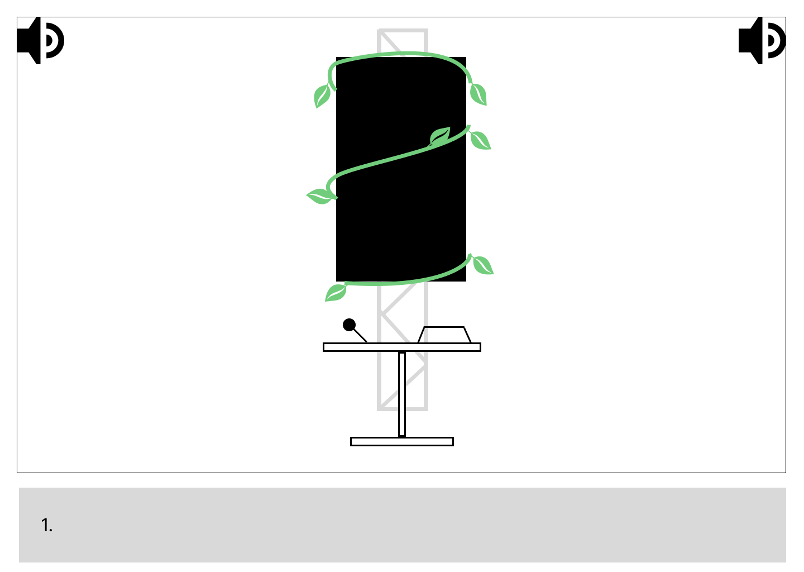

# *Resonance*
Resonance est un <ins>`projets multimedias`</ins> réalisé par les finissants de l'hiver 2025 de la Technique d'Intégration Multimédia au collège Montmorency. Ces ont été réalisés dans le cadre du cour 'Expérience multimédia' donné lors de leur dernière session. Ce cours a été encadré par `Guillaume Arseneault` et `Thomas Ouellet Fredericks`. La réalisation de ce projet a également été rendue possible grâce à l’appui de `William Racine` et `Antoine Allard`, techniciens de travaux pratiques en Technique d'Intégration Multimédias. 

L’exposition s’est tenue au <ins>`Collège Montmorency`</ins> dans la salle C-1712 et C-1710 durant la semaine du `16 mars 2025`! 

Cette exposition est donc `temporaire.` Le type d'installation est `contemplative, immersive et interactive!`   

Ma visite du lieu a eu lieu le 18 mars 2025. 

***
 
## Pourquoi ai-je créé cette fiche?
Je suis ravie d’avoir eu l’occasion d’assister à l’exposition des finissants 2025. J’ai donc décidé de `partager mes observations` sur les différents projets que j’ai explorés dans les studios TIM de Montmorency, classés ici par `ordre de préférence`!

## Au départ
Avant ma visite aux studios TIM, je me demandais comment les étudiants en multimédia parviendraient à `créer des expériences interactives et immersives` liées à leur thématique, tout en utilisant les `compétences` qu'ils ont acquises au cours de leur `formation en technique d'intégration multimédia`!

## Appréciation générale
J’ai trouvé que la `présentation` et `l’ambiance` étaient les points forts de l’expérience. Les deux salles regroupant les installations étaient plongées dans une `obscurité tamisée`, avec une lumière basse et une `mise en scène végétale` qui renforçait l’effet immersif. Cet univers donnait aux installations une `atmosphère magique` et `mystérieuse` qui les mettait en valeur.

L’exposition comptait `sept installations en tout`, dont six documentées ici. Si vous souhaitez découvrir la septième, qui est mon coup de cœur, rendez-vous sur ma fiche dédiée ici : **[C0N-0U8]()**

***

## Internature (2ème place)

<i>L'exposition Internature | Photo prise par Vicky Raymond-Janvier</i>

Ce dispositif a été crée par : `Khaly Tia Sing`, `Isaac Fafard`, `Delphine Grenier`, `Sitemonternna Yi` et `Kenza El Harrif`

## Intention
Internature est un `tunnel interactif` permettant aux visiteurs de `contrôler la croissance de la nature` autour d’eux.

## Visuel
L’installation prend la forme d’une `serre` entourée de `projections animées de faune et de flore` et de `fausses plantes`. Au centre, une `sphère lumineuse` est posée sur un pilier en bois, servant d’élément interactif principal.  

<i>La planation d'Internature | **[Voici la source de l'image!](https://tprangers.github.io/internature/#/30_production/60_plantation/)**<i>

## Interactions
La `sphère centrale` pouvait être tournée, permettant ainsi de faire `pousser la nature` autour de nous.

## Premières impressions
Dès mon arrivée, c’est la `grandeur et les couleurs` utilisées qui ont immédiatement capté mon attention. La `musique d’ambiance`, rappelant une forêt enchantée, m’a plongée dans une `atmosphère immersive` avant même d’entrer dans l’installation.

Située au centre du plus grand des studios d’exposition, Internature a été la première œuvre à `attirer mon regard`. Son `ampleur` et son `esthétisme` m’ont donné l’envie de la découvrir.

## Conclusion
Ce qui m'a particulièrement frappée, c'est l'interaction offerte par la `sphère lumineuse` au centre de l'installation. En la faisant tourner, j'ai vu la `nature autour de moi s'animer à chaque mouvement`, comme si je participais activement à la `création d'un monde végétal`. Cette interaction m'a permise de ressentir une certaine forme de `pouvoir`, mais aussi une `connexion` avec la nature.

## Cours primordiaux
En voyant ce que cette équipe a réalisé, ce projet n'aurait pas été possible sans : 
Le cour de `réalité mixte` 
Le cour d'`installation multimédia` 
Le cour de `conception d’une expérience multimédia` 

Pour avoir plus d'informations sur les cours : **[Grille de cours de la Technique d'Intégration Multimédia](https://www.cmontmorency.qc.ca/programmes/nos-programmes-detudes/techniques/techniques-dintegration-multimedia/grille-de-cours/)**

## Améliorations
Si c'était à moi de concevoir l'installation, je choisirais de `fermer complètement les deux entrées de la serre` afin de créer une `immersion totale`, sans distraction extérieure. Dans cette optique, je proposerais d’`ajouter une texture naturelle` en corélation avec les projections, afin de créer un environnement `cohérent` et `organique`.

## Autre informations
Vidéo Promotionnelle : **[Youtube](https://www.youtube.com/watch?v=vxIGUEq9AZg&t=1s)** 
Plus d'information : **[Github d'Internature](https://tprangers.github.io/internature/#)**  
Sources
> **[Github d'Internature](https://tprangers.github.io/internature/#)**

***

## Etheria (3ème place)

<i>L'exposition Etheria | Photo prise par Vicky Raymond-Janvier</i>

Ce dispositif a été crée par : `Joshua Gonzalez-Barrera`, `Victor Gileau`, `Michael Un Dupré`, `Pierre-Luc Proulx` et `Maik Hamel`

## Intention
Étheria est un jeu interactif où le but consiste à collaborer avec ses équipiers et survivre à plusieurs niveaux pour remporter la partie!

## Visuel
L’installation se présente sous la forme d'un jeu vidéo utilisant une projection animée, s'inspirant des codes des jeux de défense de tours. Le tout est projeté sur une table gris pâle, avec trois cylindres dotés d'un code QR, permettant de les utiliser comme pions pour contrôler ton personnage.  

<i>La planation d'Etheria | **[Voici la source de l'image!](https://ethereal-creators.github.io/Etheria/#/30_production/60_plantation/)**<i>

## Interactions
Bouger les cylindres permet de déplacer ton personnage, qui peut ainsi se battre. Trois joueurs peuvent y jouer simultanément, chacun ayant des pouvoirs différents et des bonus à récupérer en glissant le cylindre sur l'icône de bonus.

## Premières impressions
La simplicité de l'installation m'a interpelé, dès mon approche, j'ai pu apercevoir un logo me faisant de l'oeil avec ses mouvements et couleurs vives, ce qui m'a tout de suite donné envie d'y jouer.

## Conclusion
Ce qui m'a particulièrement marqué dans l'expérience d'Étheria, c'est l'aspect immersif du jeu et la collaboration entre les joueurs. La nécessité de défendre ensemble la pierre d'Étheria face aux vagues d'ennemis crée une dynamique de groupe intense, où chaque action a un impact sur la réussite collective. L'ambiance visuelle en pixel art et les sons rétro ajoutent une touche nostalgique tout en renforçant l'immersion dans cet univers fantastique. À travers ce jeu, j'ai ressenti un véritable esprit d'équipe et une poussée d'adrénaline, ce qui m'a incité à m'investir pleinement dans l'aventure. Cette expérience figure dans mon top trois justement à cause de l'intensité de l'expérience vécue avec mes coéquipiers.

## Cours primordiaux
En voyant ce que cette équipe a réalisé, ce projet n'aurait pas été possible sans : 
Le cour de `traitement audiovisuel ` 
Le cour d'`interactivité ludique ` 
Le cour de d'`animation 2D` 

Pour avoir plus d'informations sur les cours : **[Grille de cours de la Technique d'Intégration Multimédia](https://www.cmontmorency.qc.ca/programmes/nos-programmes-detudes/techniques/techniques-dintegration-multimedia/grille-de-cours/)**

## Améliorations
J'ai trouvé que l'espace de jeu était assez restreint, ce qui rendait difficile d'éviter les ennemis. Peut-être que des personnages plus petits ou une meilleure vue seraient des solutions à envisager. J'ai aussi trouvé que les trois pouvoirs des personnages n'étaient pas bien équilibrés. L'un d'eux n'apportait pas beaucoup d'avantages dans ce type de niveau.

## Autre informations
Vidéo Promotionnelle : **[Youtube](https://www.youtube.com/watch?v=Th9Osda2cKk)**  
Plus d'information : **[Github Etheria](https://ethereal-creators.github.io/Etheria/#/)**

Sources
> **[Github Etheria](https://ethereal-creators.github.io/Etheria/#/)**

***

## Luminatura (4ème place)

<i>L'exposition Luminatura | Photo prise par Vicky Raymond-Janvier</i>

Ce dispositif a été crée par : `Audrey Dandurand`, `Justine Rousseau`, `Camilia Bouatmani`, `Prethiah Rajaratnam` et `Ihab Mouhajer`

## Intention
Luminatura consiste à mélanger l'art et la technologie, permettant une immersion sonore et visuelle. Les visiteurs peuvent contrôler des lumières relaxantes ainsi que des sons apaisants, rappelant l'ambiance douce d'une forêt.

## Visuel
D'un point de vue visuel, de grandes fleurs blanches sont suspendues au plafond, accompagnées de lampes décoratives. On remarque également trois plaques métalliques, chacune équipée d'une stéréo.

<i>La planation de Luminatura | **[Voici la source de l'image!](https://miaou-mafia.github.io/projet-luminatura/#/30_production/60_plantation/) **<i>

## Interactions
En frottant nos mains sur les plaques métalliques, une interaction se déclenche à l'écran, nous permettant de moduler à la fois le son et les visuels. Les sons créés nous plongent dans une atmosphère apaisante et sereine.

## Premières impressions
L’esthétique de l’installation et la simplicité de l'expérience m'ont attiré vers celle-ci. Intrigué par les plaques métalliques, j’ignorais leur fonction jusqu’avant mon utilisation.

## Conclusion
Luminatura m’a offert une expérience immersive unique, où la fusion entre nature et technologie prend vie à travers une interaction simple et poétique. Toucher la plaque métallique et voir la lumière et le son réagir à ma présence m’a fait prendre conscience de notre propre conductivité et de notre pouvoir d’influencer notre environnement. L’esthétique soignée de l’installation, combinée à l’atmosphère apaisante créée par les fleurs lumineuses, les vignes et les sons naturels, m’a transporté dans un univers paisible et calme.

## Cours primordiaux
En voyant ce que cette équipe a réalisé, ce projet n'aurait pas été possible sans : 
Le cour d'`Installation multimédia` 
Le cour de `traitement audiovisuel` 
Le cour de d'`audio 2` 

Pour avoir plus d'informations sur les cours : **[Grille de cours de la Technique d'Intégration Multimédia](https://www.cmontmorency.qc.ca/programmes/nos-programmes-detudes/techniques/techniques-dintegration-multimedia/grille-de-cours/)**

## Améliorations
Luminatura m’a aussi laissé entrevoir un potentiel encore plus vaste. J’aurais aimé pouvoir explorer une interactivité diverse, un contrôle plus fin sur les variations lumineuses et sonores, afin de véritablement sculpter l’ambiance à mon rythme et selon mes sensations.

## Autre informations
Vidéo Promotionnelle : **[Youtube](https://www.youtube.com/watch?v=Jz4wxeXT_2w&t=62s))**  
Plus d'information : **[Github Etheria](https://miaou-mafia.github.io/projet-luminatura/#/))**

Sources
> **[Github Etheria](https://ethereal-creators.github.io/Etheria/#/)**

***

## Fuga (5ème place)

<i>L'exposition Fuga | Photo prise par Vicky Raymond-Janvier</i>

Ce dispositif a été crée par : `Abdel Ali Djeral`, `Daniel Dezemma`, `Matis Labelle`, `Tristan Khadka` et `Yavuz-Selim Gucluer`

----------------------------

## Intention
Le but est de permettre au visiteur de crée une foret grace a un capteur de mouvement.

## Visuel
Lorsque nous apercevons cette exposition, nous pouvons y appercevoir trois écran accrocher a une lianne montante. Chaque écran sont doté d'un haut parleur ainsi que trois capteur de mouvement devant.

<i>La planation de Fuga | **[Voici la source de l'image!](https://escapism-fuga.github.io/Fuga/#/30_production/60_plantation/) **<i>

## Interactions
Grâce au capteur de mouvement, nous pouvons crée une foret en manipulant ce meme capteur, a l'écran nous pouvons voir le résultat donnée.

## Premières impressions
Lorsque j'ai apercu l'exposition Fuga, j'ai été interpeler par l'aesthétique de celui-ci, il se démarque avec son style non organisé et de film de science fiction. 

## Conclusion
Selon moi, le résultat final reflete vraiment l'intension de l'équipe et ce démarque du style classic de la majorité des autre expositions, on peux voir que ce projet cache une histoire et te rend curieux de vouloir de la connaitre. Dans cette disposition, nous pouvons resentir la liberté de création et le coté mystérieux de l'histoire.

## Cours primordiaux
En voyant ce que cette équipe a réalisé, ce projet n'aurait pas été possible sans : 
Le cour d'`interactivité ludique` 
Le cour d'`animation 2d` 
Le cour de` d'installation multimédia` 

Pour avoir plus d'informations sur les cours : **[Grille de cours de la Technique d'Intégration Multimédia](https://www.cmontmorency.qc.ca/programmes/nos-programmes-detudes/techniques/techniques-dintegration-multimedia/grille-de-cours/)**

## Améliorations
Si j'aurais a améliorer ce projet, je me concenterais surtout sur le décors créable avec le capteur, faire plusieurs saison ou plusieurs type d'animation d'épendant du mouvement faite par l'utilisateur.

## Autre informations
Vidéo Promotionnelle : **[Youtube](https://www.youtube.com/watch?v=e6qNc1Dp68Q)**  
Plus d'information : **[Github Fuga](https://escapism-fuga.github.io/Fuga/#/)**

Sources
> **[Github Fuga](https://escapism-fuga.github.io/Fuga/#/)**

***

## Prismatica (6ème place)

<i>L'exposition Fuga | Photo prise par Vicky Raymond-Janvier</i>

Ce dispositif a été crée par : `Abdel Ali Djeral`, `Daniel Dezemma`, `Matis Labelle`, `Tristan Khadka` et `Yavuz-Selim Gucluer`

----------------------------

## Intention
Le but est de permettre au visiteur de crée une foret grace a un capteur de mouvement.

## Visuel
Lorsque nous apercevons cette exposition, nous pouvons y appercevoir trois écran accrocher a une lianne montante. Chaque écran sont doté d'un haut parleur ainsi que trois capteur de mouvement devant.

<i>La planation de Fuga | **[Voici la source de l'image!](https://escapism-fuga.github.io/Fuga/#/30_production/60_plantation/) **<i>

## Interactions
Grâce au capteur de mouvement, nous pouvons crée une foret en manipulant ce meme capteur, a l'écran nous pouvons voir le résultat donnée.

## Premières impressions
Lorsque j'ai apercu l'exposition Fuga, j'ai été interpeler par l'aesthétique de celui-ci, il se démarque avec son style non organisé et de film de science fiction. 

## Conclusion
Selon moi, le résultat final reflete vraiment l'intension de l'équipe et ce démarque du style classic de la majorité des autre expositions, on peux voir que ce projet cache une histoire et te rend curieux de vouloir de la connaitre. Dans cette disposition, nous pouvons resentir la liberté de création et le coté mystérieux de l'histoire.

## Cours primordiaux
En voyant ce que cette équipe a réalisé, ce projet n'aurait pas été possible sans : 
Le cour d'`interactivité ludique` 
Le cour d'`animation 2d` 
Le cour de` d'installation multimédia` 

Pour avoir plus d'informations sur les cours : **[Grille de cours de la Technique d'Intégration Multimédia](https://www.cmontmorency.qc.ca/programmes/nos-programmes-detudes/techniques/techniques-dintegration-multimedia/grille-de-cours/)**

## Améliorations
Si j'aurais a améliorer ce projet, je me concenterais surtout sur le décors créable avec le capteur, faire plusieurs saison ou plusieurs type d'animation d'épendant du mouvement faite par l'utilisateur.

## Autre informations
Vidéo Promotionnelle : **[Youtube](https://www.youtube.com/watch?v=e6qNc1Dp68Q)**  
Plus d'information : **[Github Fuga](https://escapism-fuga.github.io/Fuga/#/)**

Sources
> **[Github Fuga](https://escapism-fuga.github.io/Fuga/#/)**

***

## Arcadia (7ème place)

<i>L'exposition Arcadia | Photo prise par Vicky Raymond-Janvier</i>

Ce dispositif a été crée par : `Dominic Yale`, `William Beauvais` et `Anton Nikulin`

## Intention
L'intention dans ce dernier projet est de faire vivre un sentiment nostalgique a l'utilisateur a remenant les ancienne normes de jeux vidéo retro.

## Visuel
Cette exposition te ramene a l'époque 1970, l'époque des bornes d'arcade! Nous pouvons y appercvoir une une borne d'arcade retro noire ainsi que un 

Lorsque nous apercevons cette exposition, nous pouvons y appercevoir trois écran accrocher a une lianne montante. Chaque écran sont doté d'un haut parleur ainsi que trois capteur de mouvement devant.

<i>La planation de Fuga | **[Voici la source de l'image!](https://escapism-fuga.github.io/Fuga/#/30_production/60_plantation/) **<i>

## Interactions
Grâce au capteur de mouvement, nous pouvons crée une foret en manipulant ce meme capteur, a l'écran nous pouvons voir le résultat donnée.

## Premières impressions
Lorsque j'ai apercu l'exposition Fuga, j'ai été interpeler par l'aesthétique de celui-ci, il se démarque avec son style non organisé et de film de science fiction. 

## Conclusion
Selon moi, le résultat final reflete vraiment l'intension de l'équipe et ce démarque du style classic de la majorité des autre expositions, on peux voir que ce projet cache une histoire et te rend curieux de vouloir de la connaitre. Dans cette disposition, nous pouvons resentir la liberté de création et le coté mystérieux de l'histoire.

## Cours primordiaux
En voyant ce que cette équipe a réalisé, ce projet n'aurait pas été possible sans : 
Le cour d'`interactivité ludique` 
Le cour d'`animation 2d` 
Le cour de` d'installation multimédia` 

Pour avoir plus d'informations sur les cours : **[Grille de cours de la Technique d'Intégration Multimédia](https://www.cmontmorency.qc.ca/programmes/nos-programmes-detudes/techniques/techniques-dintegration-multimedia/grille-de-cours/)**

## Améliorations
Si j'aurais a améliorer ce projet, je me concenterais surtout sur le décors créable avec le capteur, faire plusieurs saison ou plusieurs type d'animation d'épendant du mouvement faite par l'utilisateur.

## Autre informations
Vidéo Promotionnelle : **[Youtube](https://www.youtube.com/watch?v=e6qNc1Dp68Q)**  
Plus d'information : **[Github Fuga](https://escapism-fuga.github.io/Fuga/#/)**

Sources
> **[Github Fuga](https://escapism-fuga.github.io/Fuga/#/)**

***

 
Prismatica
Interactivité ludique 
Traitement audiovisuel
 
Arcania
Interactivité ludique
Programmation interactive
Traitement audiovisuel

## Amélioration
 Resonance m'a beaucoup aidé à comprendre mon objectif durant mes prochaines années en tant qu'étudiante de cette technique. Cependant, ce que je changerais serait de mettre en valeur le processus de création et non seulement le dispositif finalement, lors de la présentation, je trouve que le processus met en valeur le projet fini, montrant le travail derrière un dispositif aussi complet ainsi que la persévérance de l'équipe à travers les problèmes.
 
Malgré cela, comparé à plusieurs dispositifs que j'ai pu voir par le passé, plus d'informations étaient disponibles sur place pour les plus intéressés, nous permettant ainsi de suivre la progression des équipes au cour des semaines! Ce qui a été une grande source d'inspiration pour écrire cette fiche!
 
## Réferences
Sources https://tim-montmorency.com/2025/#/

L'exposition Internature | Photo prise par Vicky Raymond-Janvier
La planation d'Internature | **[Voici la source de l'image!](https://tprangers.github.io/internature/#/30_production/60_plantation/)**
