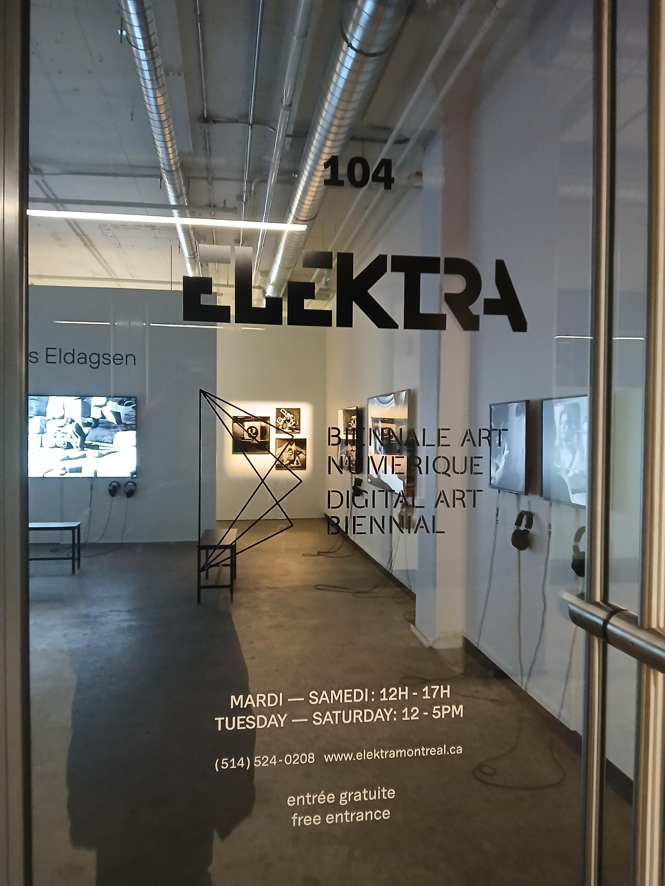
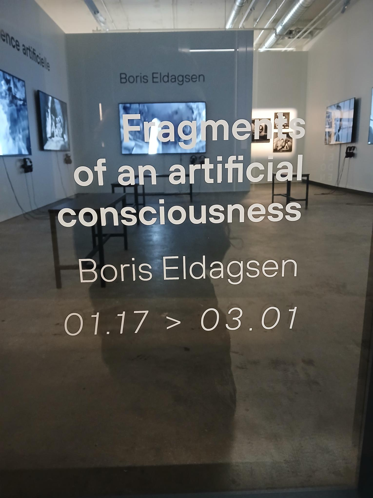
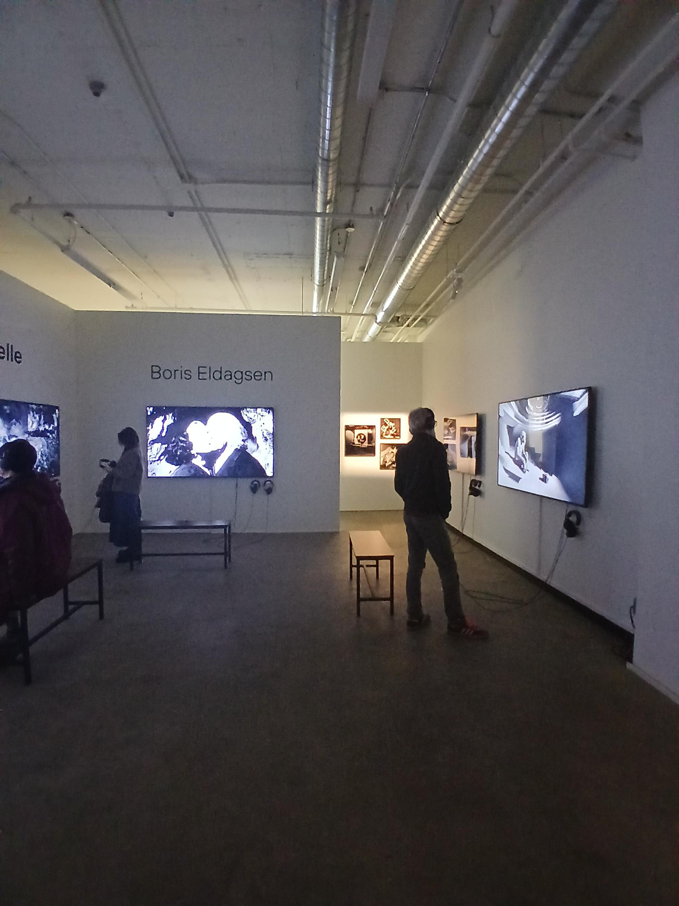
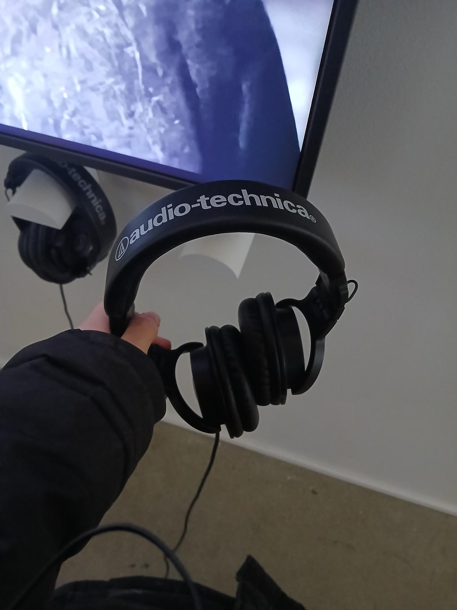
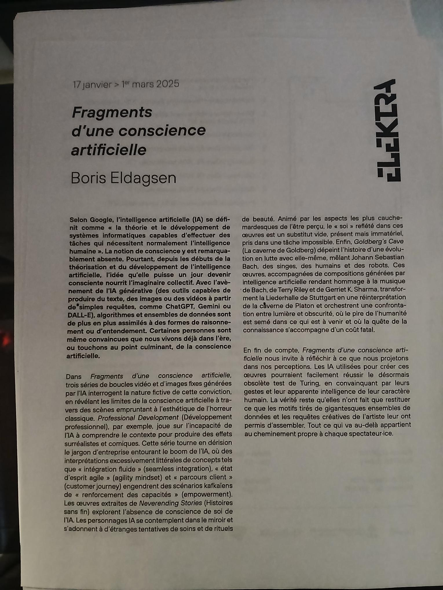
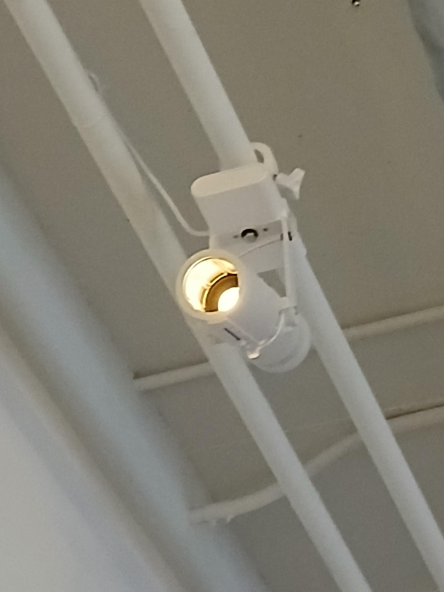
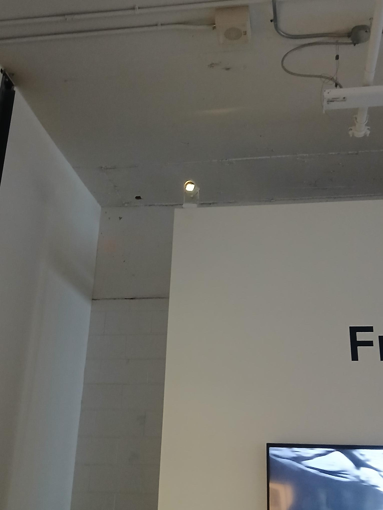
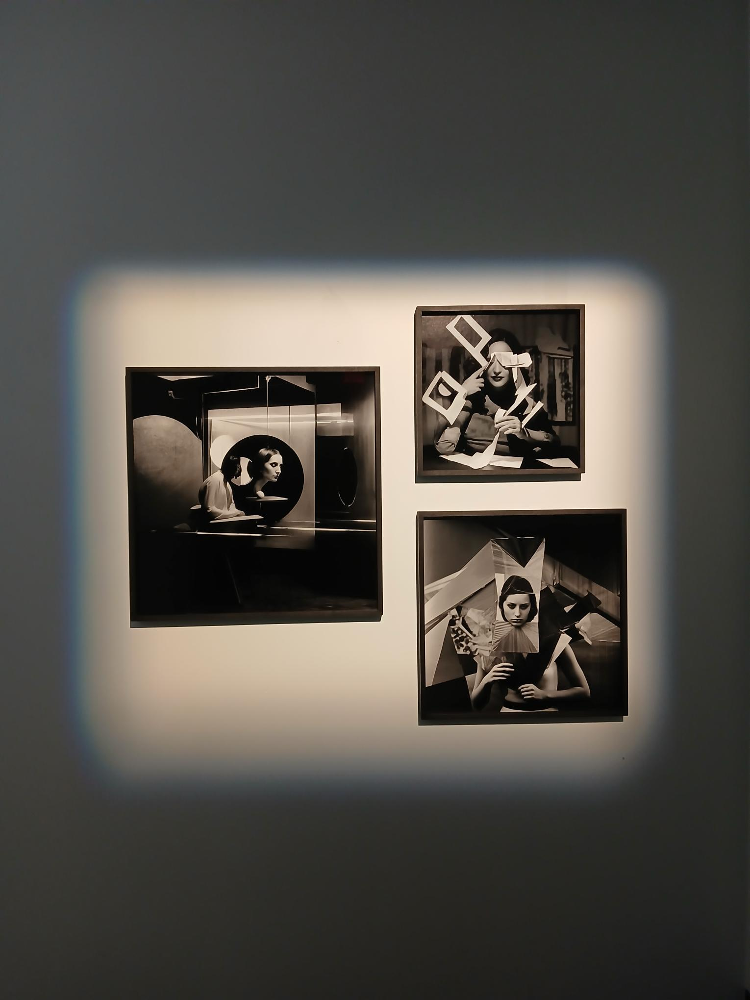

# *Fragments d'une conscience artificielle*

<i>Entrer de l'expostion Fragments d'une conscience artificielle | Photo prise par Vicky Raymond-Janvier</i>  

Elektra est une expostion réalisé par `Boris Eldagsen` le `17 janvier 2025`.  

L’exposition s’est tenue à la <ins>`Galerie ELEKTRA`</ins> situé au `5445 de Gaspé, #104 
Montréal, QC, H2T 3B2` du `17 janvier` au `1er mars 2025`!  

Cette exposition est `temporaire.` Cette installation est `immersive`  

Ma visite à eu lieu le `21 février 2025`.   

## Visuel

L'exposition est situé dans une pièce au porte vitrée. Le mur vers l'extérieur aussi vitré pour pouvoir voir le contenu de la salle.  

<i>Vu de l'extérieur de l'exposition | Photo prise par Vicky Raymond-Janvier</i>  

A l'intérieur de la salle nous pouvons y apercevoir six télévision jouant une vidéo en boucle de 21 secondes à 2 minutes 11 ainsi que 6 cadre montrant des images, les medias afficher sont en noir et blanc seulement et étant tous créé pas l'intelligence artificielle.

<i>La salle d'exposition | Photo prise par Vicky Raymond-Janvier</i>  

En bas droit des télévisions, nous apercevons y appercevoir des paires d'écouteurs jouant le son des videos.

<i>Écouteurs | Photo prise par Vicky Raymond-Janvier</i>  

Il y a aussi les trois bancs pour pouvoir apprécier l'exposition, une table avec des feuilles de papier imprimer résumant le but de l'œuvre en français et en anglais.

<i>Écouteurs | Photo prise par Vicky Raymond-Janvier</i>  

Ainsi que deux projecteurs lumineux allumée étant accroché au plafond pointant sur des images avec leur encadré en bois.

<i>Projetcteur 1 | Photo prise par Vicky Raymond-Janvier</i>  

<i>Projetcteur 2| Photo prise par Vicky Raymond-Janvier</i>  

## Intention

Cette exposition cherche à faire réfléchir le spectateur sur les limites de l'IA grace a des images et vidéos et audio realiser avec de l'atiligence artificielle.  

Ce projet est basé sur un esthétique d’horreur classique.  

Cette série se moque du langage souvent compliqué et prétentieux utilisé dans le monde de l’entreprise autour de l’intelligence artificielle. Elle montre comment des expressions comme « intégration fluide », « état d’esprit agile » ou « parcours client » peuvent être prises au pied de la lettre, ce qui mène à des situations absurdes et presque irréalistes de « renforcement des capacités ».

Les œuvres de Neverending Stories parlent du fait que les intelligences artificielles n'ont pas de vraie conscience d’elles-mêmes. On y voit des personnages IA se regarder dans le miroir, faire des soins ou des rituels de beauté étrange. Leur humains semble vide, présent mais sans consistance, bloqué dans une tâche sans fin ni but clair.

Dans Goldberg’s Cave, l’artiste raconte une évolution en conflit avec elle-même, en mélangeant des éléments de Bach, des singes, des humains et des robots. Des musiques créées par IA, inspirées de Bach, Terry Riley et Gerriet K. Sharma, transforment la salle Liederhalle de Stuttgart en une version moderne de la caverne de Platon. L’installation crée un contraste fort entre la lumière et l’ombre, et montre comment nos pires défauts peuvent se retrouver dans les technologies à venir. Elle rappelle aussi que chercher à comprendre peut avoir un prix.

Au final, Fragments d’une conscience artificielle nous pousse à réfléchir à ce que nous projetons dans les machines. Les IA qui ont participé à ces œuvres pourraient facilement tromper les gens en leur faisant croire qu’elles sont intelligentes, mais elles ne font en réalité que reproduire ce que les données et les instructions humaines leur ont appris. Ce que l’on croit voir en plus vient de notre propre imagination et de notre regard.

## Pourquoi ai-je choisi fragments d'une conscience artificielle?

J'ai choisi Elektra surtout à cause des couleurs utilisées ainsi que l'ambiance un peu malsène, ce qui selon moi, cela la fait ressortir du los. A cause de ma passion pour l'art quelque chose qui m'a toutefois aussi interpellé était la raison de création, ayant un symboliste et une raison d'exister voulant transmettre un message qui selon moi est clair et important a montrer.

## Les 12 réalisation était :

1. The Electrician
Série « Pseudomnesia I »
Réalisé en 2022
Type de media : Encadré
Dimenssions : 26 × 15 cm

2. MeMeMe
Série « Neverending Stories »
Réalisé en 2024
Type de media : Vidéo
Temps : Boucle vidéo de 21 secondes

3. Wheelchair of Enlightenment
Série « Neverending Stories »
Réalisé en 2024
Type de media : Vidéo
Temps :  Boucle vidéo de 22 secondes

4. Goldberg’s Cave #1
Réalisé en 2024
Type de media : Vidéo
Temps :  Boucle vidéo de 57 secondes

5. Goldberg’s Cave #2
Réalisé en 2024
Type de media : Vidéo
Temps :  Boucle vidéo de 1 minute et 41 secondes

6. Goldberg’s Cave #3
Réalisé en 2024
Type de media : Vidéo
Temps :  Boucle vidéo de 1 minute et 30 secondes

7. Goldberg’s Cave #4
Réalisé en 2024
Type de media : Vidéo
Temps :  Boucle vidéo de 1 minute et 18 secondes

8. Goldberg’s Cave #5
Réalisé en 2024
Type de media : Vidéo
Temps :  Boucle vidéo de 1 minute et 11 secondes

9. Professional Development
Réalisé en 2024
Type de media : Vidéo
Temps :  Boucle vidéo de 2 minute et 11 secondes

10. Psychoanalysis Gone Wrong
Série « Pseudomnesia III »
Réalisé en 2023
Type de media : Encadré
Dimenssions : 41 × 41 cm

11. The Clairvoyant
Série « Pseudomnesia III »
Réalisé en 2023
Type de media : Encadré
Dimenssions : 61 × 61 cm

12. Muse II
Série « Pseudomnesia III »
Réalisé en 2023
Type de media : Encadré
Dimenssions : 51 × 51 cm

<i>Exposition 1 2 3 | Photo prise par Vicky Raymond-Janvier</i>  

<i>Exposition 10, 11 et 12 | Photo prise par Vicky Raymond-Janvier</i>  

## Appréciation

J'ai beaucoup aimé ma visite a Elektra, nous pouvions voir que tout à été placée et penser, les vidéos était captivante et surtout intrigante, nous donnant toujours envie d'en voir plus. Cependant a ce que certaine personne pourrait penser, j'ai bien aimé qu'il n'y ait peu d'interactiviter, selon moi cela donne un effet d'impuissance a ce que l'on voit ce qui reflète le monde grandissant de l'AI sans que nous ne pouvons rien faire, ce qui selon moi renforce le sentiment voulant être exprimé.

## Point a amélioré
Un point qui selon moi saute au yeux, la longueur de l'exposition, l'exposition ne dure que très peu de temps et nous permet pas de ressentir l'intensité de l'exposition a part si l'ont ni reste pour une longue période de temps, ce qui a était mon cas mais j'ai pu apercevoir plusieurs personnes partir assez tôt, ce qui montre que beaucoup de personnes passe a coté de l'expérience voulant être transmise par le créateur.

***

## Conclusion

## Plus d'information
**[Site officiel](https://www.elektramontreal.ca/fragments-of-an-artificial-consciousness-boris-eldagsen?lang=fr)**   
**[Instagram officiel](https://www.instagram.com/elektramontreal/)**   
**[Feuille d'exposition](https://www.eldagsen.com/wp-content/uploads/2025/01/Feuillets-dexposition-Fragments-dune-conscience-artificielle.pdf)**

Sources

> **[Feuille d'exposition](https://www.eldagsen.com/wp-content/uploads/2025/01/Feuillets-dexposition-Fragments-dune-conscience-artificielle.pdf)**

***

