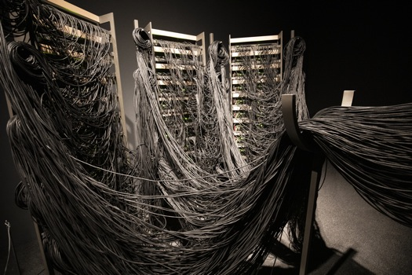

## Introduction
Dans ce monde, plusieurs structures se construisent chaque jour pour plein de raisons, mais qu'en est-il de l'art? L'art nous submerge d'émotions, mais d'où viennent ces œuvres? Comment parviennent-elles à être créées? Aujourd'hui nous allons suivre les créations de `l'atelier de création de Rafael Lozano-Hemmer` grâce à une conférence donnée par l'une de ces employées `Jade Séguela` ayant été donnée dans la salle `Claude Legault` au collège Montmorency le `25 mars 2025`! Le but de cette fiche est de parler des `points importants` de la présentation de Jade Séguela ainsi nous permettant de découvrir une partie du `processus` derrière d'une de cette envergure.  

<i>La conférence de Jade Séguela | Photo prise par Vicky Raymond-Janvier</i>  

##
**Pour commencer, un peu de contexte s'impose, `qui est Jade Séguela et Rafael Lazano-Hemmer?`**  

`Jade Séguela`, que nous pouvons voir à droite dans la photo plus haut, est une registraire travaillant pour Rafael Lazano-Hemmer depuis plusieurs années déjà. Elle a étudié et obtenu un baccalauréat en beaux-arts, une maîtrise en muséologie ainsi qu'un DEC en art lettres et communication!**   

**`Rafael Lazano-Hemmer`**

<i>Rafeal Lozano Hemmer | Photo prise par Alchetron | **[Voici la source de l'image!](https://www.widewalls.ch/artists/rafael-lozano-hemmer)** </i>

Rafael Lazano-Hemmer est un artiste multimédia mélangeant l'art conceptuel et l'art contemporain. Il est propriétaire d'un studio à son nom, ce qui lui a permis de créer plusieurs dizaines d'oeuvres dans sa carrière.

## Sphere Packing
  
<i>Sphere Packing | Photo prise par Mariana Yañez | **[Voici la source de l'image!](https://www.lozano-hemmer.com/showimage_emb.php?proj=sphere_packing_bach&img=monterrey_2019&idproj=&type=artwork&id=3)** </i>

  
<i>Sphere Packing | Photo prise par Mariana Yañez | **[Voici la source de l'image!](https://www.lozano-hemmer.com/showimage_emb.php?proj=sphere_packing_bach&img=monterrey_2019&idproj=&type=artwork&id=4)** </i>

Sphere Packing: Bach, de son nom complet est une sphere en bois d

 œuvre basée sur une multitude de pistes audio des compositions de Johann Sebastian Bach installées dans une sphère artisanale en bois de 3 mètres de diamètre où l'on les y fait jouer grâce aux nombreux haut-parleurs qui permettent une ambiance surchargée et enveloppante. Même si celle-ci était la première installation présentée et qu'elle paraissait la moins complexe, elle était pourtant extrêmement difficile et encombrante à mettre en place. Mis à part l'impressionnante quantité de câbles d'alimentation ainsi que la durée de l'installation (quelques journées entières), cette œuvre est le résultat d'énormément de travail d'équipe, coordination, et surtout de beaucoup d'efforts.

## Conclusion
Pour conclure, j'ai aimé apprendre comment fonctionne l'artiste Rafeal Lozano Hemmer et comment ils s'y prennent pour créer de telles œuvres. J'aurais aimé pouvoir entendre parler de plus de créations créées par ce studio, cependant le temps nous en empêchant. J'ai trouvé que la présentation avait un bon rythme et nous gardait captivés.

## Autre informations
Vidéo installation de Sphere Packing : **[Installation](https://www.youtube.com/watch?v=j5224gPEVgU)**  
Plus d'information : **[Sphere Packing Bach| ATELIER LOZANO-HEMMER](https://www.lozano-hemmer.com/sphere_packing_bach.php)**   

Sources
> **[Wikipedia de Rafeal Lozano Hemmer](https://fr.wikipedia.org/wiki/Rafael_Lozano-Hemmer)**

***
