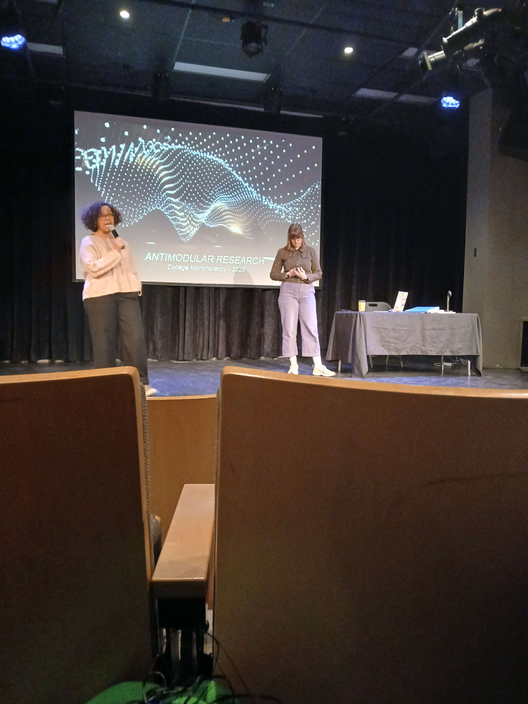
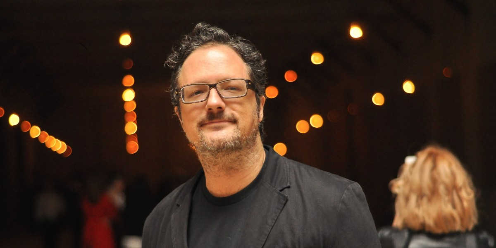

## Introduction
Dans ce monde, plusieurs structures se construisent chaque jour pour plein de raisons, mais qu'en est-il de l'art? L'art nous submerge d'émotions, mais d'où viennent ces œuvres? Comment parviennent-elles à être créées? Aujourd'hui nous allons suivre les créations de `l'atelier de création de Rafael Lozano-Hemmer` grâce à une conférence donnée par l'une de ces employées `Jade Séguela` ayant été donnée dans la salle `André Mathieu` au collège Montmorency le `25 mars 2025`! Le but de cette fiche est de parler des `points importants` de la présentation de Jade Séguela ainsi nous permettant de découvrir une partie du `processus` derrière des créations de cette envergure.  

<i>La conférence de Jade Séguela | Photo prise par Vicky Raymond-Janvier</i>  

Pour commencer, un peu de contexte s'impose, `qui est Jade Séguela et Rafael Lazano-Hemmer?`
`Jade Séguela`, que nous pouvons voir à droite dans la photo plus haut, est une registraire travaillant pour Rafael Lazano-Hemmer depuis plusieurs années déjà. Elle a étudié et obtenu un Baccalauréat en Beaux-Arts, une maîtrise en muséologie ainsi qu'un DEC en art lettres et communication!

##

`Rafael Lazano-Hemmer`

<i>Rafeal Lozano Hemmer | Photo prise par Alchetron | **[Voici la source de l'image!](https://www.widewalls.ch/artists/rafael-lozano-hemmer)** </i>

## Visuel
L’installation prend la forme d’une `serre` entourée de `projections animées de faune et de flore` ainsi que de `fausses plantes`. Au centre, une `sphère lumineuse` est posée sur un pilier en bois, servant d’élément interactif principal.  

<i>La planation d'Internature | **[Voici la source de l'image!](https://tprangers.github.io/internature/#/30_production/60_plantation/)** <i>

## Interactions
La `sphère centrale` pouvait être tournée, permettant ainsi de faire `pousser la nature` autour de nous.

## Premières impressions
Dès mon arrivée, c’est la `grandeur et les couleurs` utilisées qui ont immédiatement capté mon attention. La `musique d’ambiance`, rappelant une forêt enchantée, m’a plongée dans une `atmosphère immersive` avant même d’entrer dans l’installation.

Située au centre du plus grand des studios d’exposition, Internature a été la première œuvre à `attirer mon regard`. Son `ampleur` et son `esthétisme` m’ont donné l’envie de la découvrir.

## Conclusion
Ce qui m'a particulièrement frappée, c'est l'interaction offerte par la `sphère lumineuse` au centre de l'installation. En la faisant tourner, j'ai vu la `nature autour de moi s'animer à chaque mouvement`, comme si je participais activement à la `création d'un monde végétal`. Cette interaction m'a permise de ressentir une certaine forme de `pouvoir`, mais aussi une `connexion` avec la nature.

## Cours primordiaux
En voyant ce que cette équipe a réalisé, ce projet n'aurait pas été possible sans : 
Le cour de `réalité mixte` 
Le cour d'`installation multimédia` 
Le cour de `conception d’une expérience multimédia` 

Pour avoir plus d'informations sur les cours : **[Grille de cours de la Technique d'Intégration Multimédia](https://www.cmontmorency.qc.ca/programmes/nos-programmes-detudes/techniques/techniques-dintegration-multimedia/grille-de-cours/)**

## Améliorations
Si c'était à moi de concevoir l'installation, je choisirais de `fermer complètement les deux entrées de la serre` afin de créer une `immersion totale`, sans distraction extérieure. Dans cette optique, je proposerais d’`ajouter une texture naturelle` en corélation avec les projections, afin de créer un environnement `cohérent` et `organique`.

## Autre informations
Vidéo Promotionnelle : **[Youtube](https://www.youtube.com/watch?v=vxIGUEq9AZg&t=1s)**  
Plus d'information : **[Github d'Internature](https://tprangers.github.io/internature/#)**   
Sources
> **[Github d'Internature](https://tprangers.github.io/internature/#)**

***
