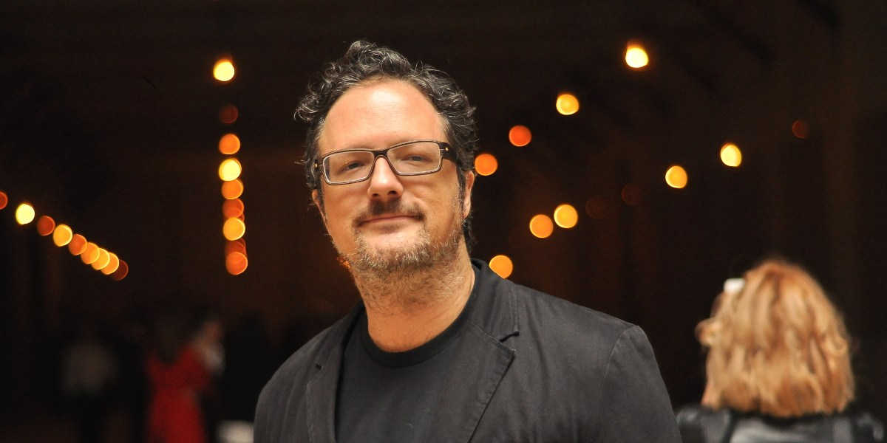
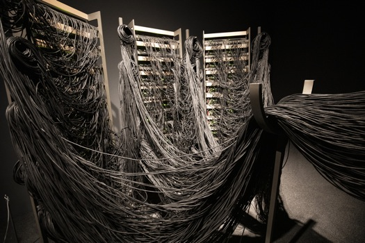

## Introduction
Dans ce monde, plusieurs structures se construisent chaque jour pour plein de raisons, mais qu'en est-il de l'art? L'art nous submerge d'émotions, mais d'où viennent ces œuvres? Comment parviennent-elles à être créées? Aujourd'hui nous allons suivre les créations de `l'atelier de création de Rafael Lozano-Hemmer` grâce à une conférence donnée par l'une de ces employées `Jade Séguela` ayant été donnée dans la salle `Claude Legault` au collège Montmorency le `25 mars 2025`! Le but de cette fiche est de parler des `points importants` de la présentation de Jade Séguela ainsi nous permettant de découvrir une partie du `processus` derrière d'une de cette envergure.  

<i>La conférence de Jade Séguela | Photo prise par Vicky Raymond-Janvier</i>  

##
**Pour commencer, un peu de contexte s'impose, `qui est Jade Séguela et Rafael Lazano-Hemmer?`**  

`Jade Séguela`, que nous pouvons voir à droite dans la photo plus haut, est une registraire travaillant pour Rafael Lazano-Hemmer depuis plusieurs années déjà. Elle a étudié et obtenu un baccalauréat en beaux-arts, une maîtrise en muséologie ainsi qu'un DEC en art lettres et communication!**   

**`Rafael Lazano-Hemmer`**

<i>Rafeal Lozano Hemmer | Photo prise par Alchetron | **[Voici la source de l'image!](https://www.widewalls.ch/artists/rafael-lozano-hemmer)** </i>

Rafael Lazano-Hemmer est un artiste multimédia mélangeant l'art conceptuel et l'art contemporain. Il est propriétaire d'un studio à son nom, ce qui lui a permis de créer plusieurs dizaines d'oeuvres dans sa carrière.

## Sphere Packing
  
<i>Sphere Packing | Photo prise par Mariana Yañez | **[Voici la source de l'image!](https://www.lozano-hemmer.com/showimage_emb.php?proj=sphere_packing_bach&img=monterrey_2019&idproj=&type=artwork&id=3)** </i>

  
<i>Sphere Packing | Photo prise par Mariana Yañez | **[Voici la source de l'image!](https://www.lozano-hemmer.com/showimage_emb.php?proj=sphere_packing_bach&img=monterrey_2019&idproj=&type=artwork&id=4)** </i>

Sphere Packing: Bach, de son nom complet, est une sphère en bois de 3 mètres sur 3 mètres pesant 300 kilos. Nous pouvons aussi y apercevoir 1128 haut-parleurs tous autour de la sphère jouant différentes compositions de Johann Sabastian, reliés à 11 km de câbles branchés, les permettant de fonctionner. Quand nous entrons à l'intérieur de cette sphère, nous sommes immergés dans une cacophonie de sons. 

Jade ira en détail pour expliquer comment cette œuvre a été montée, devant être séparée en environ 9 parties, disant ainsi que cela a pris plusieurs jours entiers pour brancher les haut-parleurs. Elle ira aussi en détail sur le fait que cette oeuvre a été réalisée 3 fois, donc une ou deux vendues et comment fonctionne l'achat de cette oeuvre.

## Conclusion
Pour conclure, j'ai aimé apprendre comment fonctionne l'artiste Rafeal Lozano Hemmer et comment ils s'y prennent pour créer de telles œuvres. J'aurais aimé pouvoir entendre parler de plus de créations créées par ce studio, cependant le temps nous en empêchant. J'ai trouvé que la présentation avait un bon rythme et nous gardait captivés.

## Autre informations
Vidéo installation de Sphere Packing : **[Installation](https://www.youtube.com/watch?v=j5224gPEVgU)**  
Plus d'information : **[Sphere Packing Bach | ATELIER LOZANO-HEMMER](https://www.lozano-hemmer.com/sphere_packing_bach.php)**   

Sources
> **[Wikipedia de Rafeal Lozano Hemmer](https://fr.wikipedia.org/wiki/Rafael_Lozano-Hemmer)**  
> **[Sphere Packing Bach | ATELIER LOZANO-HEMMER](https://www.lozano-hemmer.com/sphere_packing_bach.php)** 
***
